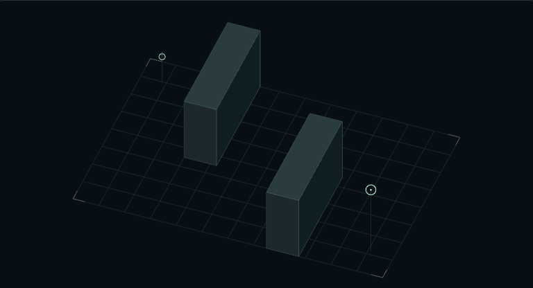
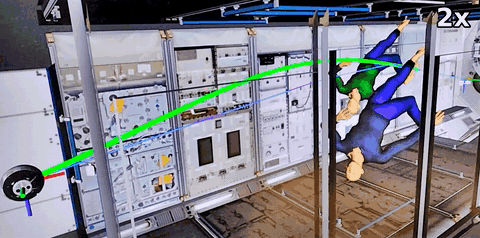
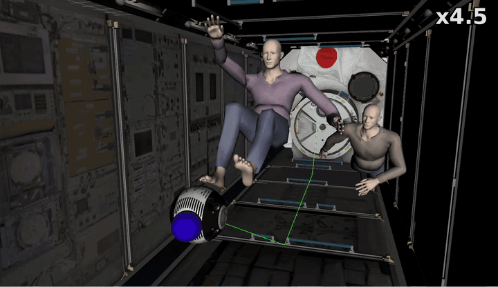
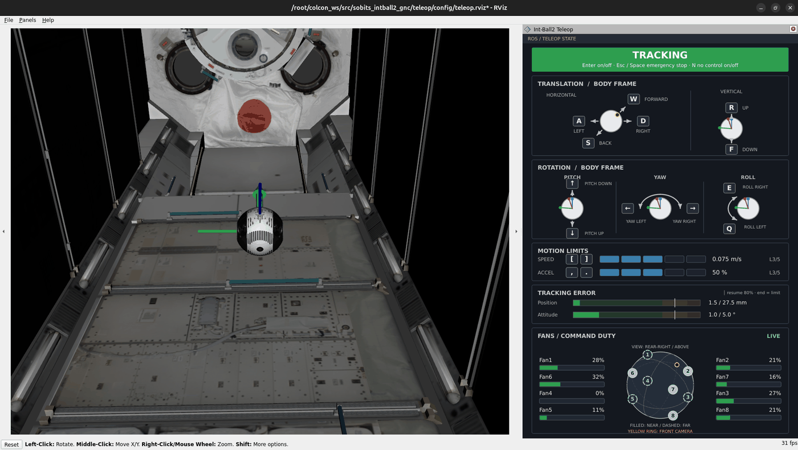

  
  

# Ryo Jochi

創価大学理工学研究科情報システム工学専攻の大学院生。Team SOBITS所属。関心分野はロボティクスと自律システム。

所属チーム: [Team SOBITS](https://github.com/TeamSOBITS)

[詳しくはこちら](https://rjochi.github.io/Rjochi/)

経路探索・曲線化・移動の流れを示す幾何学デモです。推力や機体特性を考慮した軌道生成・制御は再現していません。

## 代表的な取り組み

- **微重力空間での自律移動**（sobits_intball2_gnc）
  - JAXAのInt-Ball2シミュレータを対象に、微重力空間での三次元自律移動と宇宙飛行士の検知・回避に取り組むパッケージ
  - [humble-devel](https://github.com/TeamSOBITS/sobits_intball2_gnc/tree/humble-devel)（ROS 2）: MINCOによる宇宙飛行士の回避
     
  - [noetic-devel](https://github.com/TeamSOBITS/sobits_intball2_gnc/tree/noetic-devel)（ROS 1）: 大会で使用した実装
     
  - キーボードテレオペ: キー操作で機体を動かせます。RVizで速度・誤差・8基のファンの指令dutyも確認できます。
     
- **宇宙ロボットの制御インターフェース**（[intball2_common](https://github.com/TeamSOBITS/intball2_common/tree/humble-devel)）
  - JAXAのInt-Ball2シミュレータ上のロボットを、外部のROS 2プログラムから制御するための共通パッケージ
- **ROS 1 / ROS 2をつなぐ開発環境**（[int-ball2_platform_works](https://github.com/TeamSOBITS/int-ball2_platform_works/tree/humble-bridge)）
  - ROS 1で動作するInt-Ball2シミュレータとROS 2のユーザープログラムをつなぐDocker環境
- **ローカル音声認識のROS 2統合**（[sobits_speech_recognition](https://github.com/TeamSOBITS/sobits_speech_recognition/tree/jazzy-devel)）
  - ローカルPCで動作する音声認識モデルを、ROS 2のActionインターフェースで利用するためのパッケージ
- **ローカル音声合成のROS 2統合**（[sobits_tts](https://github.com/TeamSOBITS/sobits_tts/tree/jazzy-devel)）
  - ローカルPCで動作する音声合成モデルを、ROS 2のActionインターフェースで利用するためのパッケージ
- **LLM（Groq API）のROS 2統合**（[groq_ros](https://github.com/TeamSOBITS/groq_ros/tree/jazzy-devel)）
  - Groq APIを介した大規模言語モデルとの対話を、ROS 2のActionインターフェースで利用するためのパッケージ
  - テキスト・画像入力と関数呼び出しに対応
- **ロボットの頭部ディスプレイ制御**（[esp32_display](https://github.com/TeamSOBITS/esp32_display/tree/jazzy-devel)）
  - ESP32を介して頭部ディスプレイを制御するパッケージ
     
